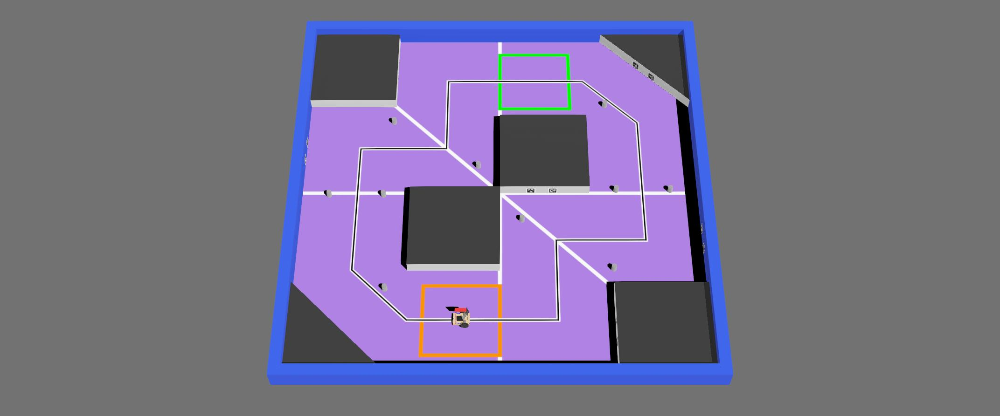
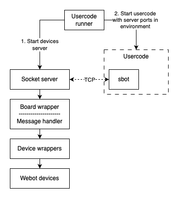
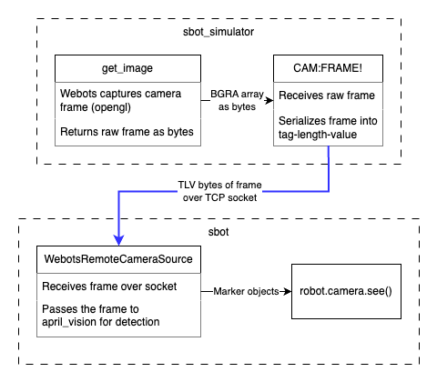

# sbot_simulator
A simulator built around Webots to use the sr-robot3 library virtually.



### This is a work in progress

## Installation

First, you need to install Webots. You can download the latest version from the [Webots website](https://cyberbotics.com/#download).
After cloning the repository, you can install the simulator using the setup script.
```bash
./scripts/setup.py
```
This script will create a virtual environment, install the required dependencies and set up Webots to use this virtual environment.
Alternatively, you can install the simulator manually by following the steps below.
```bash
python3 -m venv venv
source venv/bin/activate
pip install -r requirements.txt
```
You will also need to set the Python paramter in the Webots preferences to point at the python binary in the virtual environment.

If you are intending to develop the API components of the simulator, you can install the sr-robot3 library in development mode as this is where the competitor facing API is defined.
```bash
git clone https://github.com/srobo/sr-robot3.git
pip install -e ../sr-robot3
```

## Development

When debugging the simulator, you can use the `WEBOTS_DEVICE_LOGGING` environment variable to set the logging level of the devices in the simulator.
By default, this is set to `WARNING`, setting it to `INFO` will log most device interactions and setting it to `DEBUG` will log all socket communication.
This can be achieved using the [runtime.ini file](https://cyberbotics.com/doc/guide/controller-programming#environment-variables) in Webots.

### CI checks (linting and type checking)
To run the CI checks locally, you can install the development requirements and run the check commands.
```bash
pip install -r dev_requirements.txt
poe lint
poe type
```

Linting errors can also be observed in real-time using the vscode extension charliermarsh.ruff after installing the development requirements.

### Testing (__FUTURE FEATURE__)

Unit and integration tests are grouped into two categories: those that don't require Webots and those that do.
The former can be run using the `poe test` command, while the latter can be run using the `poe webots-test` command.

### Releases

CI generates a release archive for each commit that can be viewed on the [actions page](https://github.com/sourcebots/sbot_simulator/actions/workflows/check.yml).
This archive contains the minimal files to install and run the simulator and a [user facing readme](assets/user_readme.md).

To generate a full release, create and push a tag with the version number.
The tag name will be used as the version number in the release archive.
The format of the tag should be `sroYYYY.X` where `YYYY` is the year and `X` is the release number for that year.

To generate a release locally, you can use one of the following commands. The version number is generated by git describe, so a local tag can be used to generate a clean version number.
```bash
# If you installed dev_requirements.txt
poe release
# Else
./scripts/generate_release.py
```

## How it works

This repository itself does not provide a user-facing API, but instead uses the [sr-robot3 library](https://github.com/srobo/sr-robot3) to provide the API.
Since the sr-robot3 library is also used for the physical robots, this avoids the common issue of the simulator and physical robots having different APIs.
The simulator is built around Webots, a popular robotics simulator, and uses the Python API to interact with the devices in the simulator.

This interaction with Webots and sr-robot3 is achieved by using the pyserial library's ability to connect to a socket in the same way it would connect to a serial port. This allows the sr-robot3 library to interact with the devices in the simulator in the same way it would interact with the physical devices.

This mode of operation is enabled in sr-robot3 by setting the `WEBOTS_SIMULATOR` environment variable to `1`. Once this is set, the sr-robot3 library will use the value of the `WEBOTS_ROBOT` environment variable to determine the device URLs to connect to instead of attempting to discover boards connected to physical serial ports. The abstraction layers inside the simulator then follow the diagram below. The board wrapper classes implement an equivalent message handler to those in the physical board firmwares, while the device wrapper classes handle the Webots API calls to interact with the devices in the simulator.



A few devices don't normally use a serial port but do interface with sockets to the simulator, these include the LED board, the camera interface and the sleep command. The way vision is handled in the simulator is by creating a new frame source in sr-robot3 that reads the camera image from the simulator and processes it in the same way as the physical camera, as shown in the diagram below.



Whilst this does mean that a large amount of data is sent over the socket, the simulator is designed to run on the same machine as the sr-robot3 library, so this is not a significant issue.

Metadata is handled by setting the `SBOT_METADATA_PATH` environment variable to a temporary directory. This directory acts like the metadata USB sticks in the physical robots, and has a `metadata.json` file containing the zone and mode of the robot.

### World Design Notes

To simplify creating the arenas in the simulator, a set of proto files are used to define the arena layout.
The [arena proto](simulator/protos/arena/Arena.proto) takes the outer dimensions of the arena and generates a bounding box to contain the arena, along with a set of visual walls.
This can also be supplied with a texture for the floor to mark out staring and scoring zones.

A [marker proto](simulator/protos/props/Marker.proto) provides a standard way to add markers to the arena, which can be used on walls and tokens.
This uses a plane to define the marker, without casting any shadows, or including its own bounding box.

## Project Structure

In order to keep the released simulator tidy and easy to use, the project is split into a few key folders. The main simulator code is in the `simulator` folder which should only contain the code that is used to run the simulator. The `example_robots` folder contains a simple robot that can be used to start coding with the simulator and a keyboard controlled robot to explore the available sensors. Additionally the `scripts` folder contains the setup script and other utility scripts for the competitiors.

Alongside these folders that are placed in the releases, the `assets` folder contains images and other resources that are used in the documentation. These are used to render an HTML page user facing readme that is included in the release archive.

Of the the folders that are not included in the release, the `tests` folder contains the unit and integration tests for the simulator that don't require running webots and the `test_simulator` folder contains a separate webots world that is used to test the simulator.

## Project Status

1. ~~device spinup~~
2. ~~debug logs~~
3. ~~test devices~~
4. ~~webots devices~~
5. ~~usercode runner~~
6. ~~vision~~
7. ~~arena~~
    - ~~box~~
    - ~~deck~~
    - ~~triangle deck~~
    - ~~floor texture~~
        - ~~line~~
        - ~~scoring lines~~
        - ~~starting zones~~
8. ~~robot~~
9. ~~device jitter~~
    - ~~in Webots~~
        - ~~Ultrasound noise~~
        - ~~Reflectance sensor noise~~
    - ~~in python~~
        - ~~motor noise~~
        - ~~servo noise~~
10. sbot updates
    1. ~~simulator discovery~~
    2. ~~vision~~
    3. ~~leds~~
    4. ~~sleep & time~~
    5. Windows startup performance
11. ~~keyboard robot~~
12. ~~setup script~~
13. ~~releases~~
14. documentation
    1. ~~dev setup~~
    2. user usage
    3. ~~how it works~~
15. simulator tests
    - vision position
    - vision orientation
    - distance sensor
    - reflectance sensor
    - bump sensor
    - motor
    - servo
16. ~~linting~~
17. ~~CI~~
18. report currents
19. supervisor
20. comp match running
