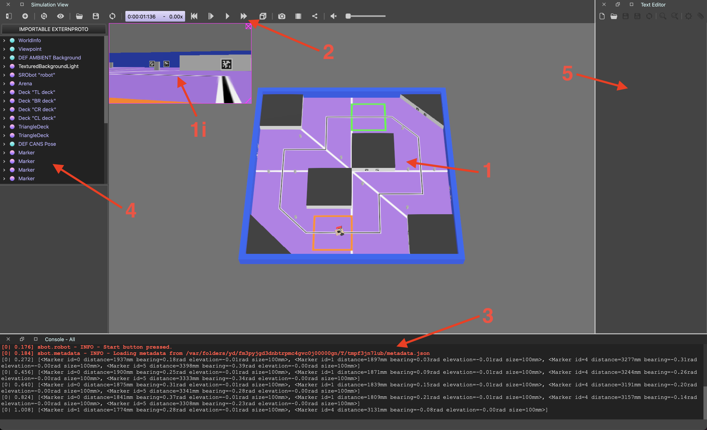
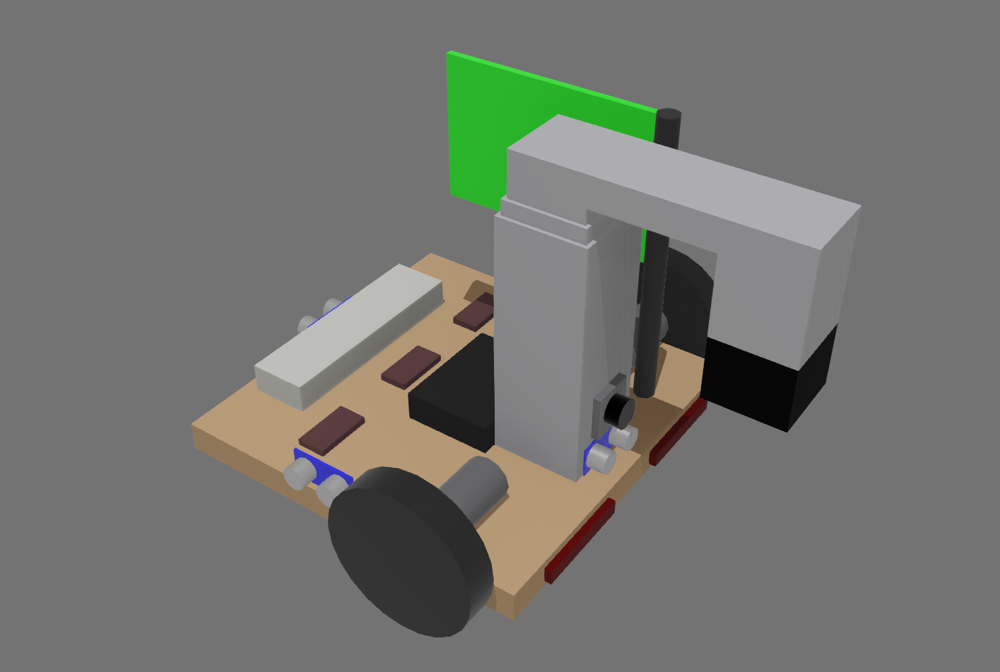

# The sbot Simulator

---

The robotics simulator for sr-robot3 used by Student Robotics, powered by Webots.
This simulator was originally developed by the [Southampton Robotics Outreach society](https://roboticsoutreach.org/) for the Smallpeice competition and has been adapted for use by
Student Robotics.

The simulator is a useful development tool that allows you to become familiar with our API and test out robotics concepts even if you haven't finished building your robot yet.

The simulator is built around the [Webots](https://cyberbotics.com/#download) platform, which runs the simulation.
You control the virtual robot using the [sr-robot3 API](https://pypi.org/project/sr-robot3/), just like on the physical robots.

## Setup
In order to use the simulator a few set-up steps need to be done.
First you need to install Python 3.9+ and Webots R2023b.

To install Python, you can download the latest version from the [Python website](https://www.python.org/downloads/). If you have already installed Python from a package manager, such as homebrew on MacOS, apt on Ubuntu, or the Windows store on Windows, you can skip this step.

To install Webots, you can download the latest version from the [Webots website](https://cyberbotics.com/#download). Use the default settings when installing Webots.

Once you have installed these, for the rest of this guide you will want to start from the folder have you extracted this simulator into.

The contents of the folder should look like this:

- The `simulator` folder contains our code to support running your code in the simulator.
- The `zone_0` folder is where you will write your code, and it must contain a file called `robot.py`.
- The `setup.py` and `run_simulator.py` files are used to set up the environment and run the simulator respectively.
- The `readme.html` file contains a single page guide to using the simulator, similar to this one.

**Note:**
: If you had previously downloaded the simulator, you can copy your code from the previous installation by copying just the `zone_0` folder from the old installation to the new one.

### Setting up the Environment

Now that you have downloaded and extracted the simulator, you need to set up the environment to run the simulator.
Since the simulator uses the sr-robot3 library, there are a series of python packages that need to be installed and Webots needs to be configured to use the correct version of Python.
We have provided a script that will set up this environment for you.

Starting in the folder you extracted the simulator into, run the script called `setup.py and it will set up the environment for you.
A terminal window will open and you will see the output of the script, if there are any errors displayed check the [Troubleshooting](#troubleshooting) section for help.

**Note:**
: In order to run the Python script, instead of opening the file you may need to right-click and select **Open with** &rarr; **Python**.
  

**Note:**
: On recent versions of macOS you may need to give Python permission to access the directory where you have extracted the simulation files.

This will create a contained python installation with the required libraries in a `venv` folder, this is called a virtual environment.
This also configures the Webots settings to use the correct version of Python.

### Opening the Arena

Before you can start using the simulator, you need to have followed the steps in the [Setting up the Simulator](#setting-up-the-environment) section.

To open the arena, you need to start in the folder you extracted the simulator during setup and run the `run_simulator.py` script.
This will open Webots with the arena loaded and ready to run your code.

**Note:**
: In order to run the Python script, instead of opening the file you may need to right-click and select **Open with** &rarr; **Python**.
  

**Note:**
: On recent versions of macOS you may need to give Webots permission to access the directory where you have extracted the simulation files.

## The Webots Interface

After opening the arena, you shoudl see a window similar to the one below.
This is the Webots interface, which has 5 key areas:

1. The 3D world where the simulation takes place.
    1. The camera overlay, which shows the images from the robot's camera.
2. The time controls, which allow you to control the speed of the simulation.
3. The console, which shows logs from your code.
4. The "Scene Tree" which shows the objects in the simulation.
5. The built-in text editor, which allows you to edit your code. We recommend using an external editor instead to make use of features like syntax highlighting and code completion.

### The Camera Overlay

The camera overlay shows the images from the robot's camera.
This only updates when `robot.camera.see()` is called in your code.

This image is the raw image that the robot sees, and is not processed in any way.
To see the processed image, you have to save the images to a file just like on the physical robot.

If the camera overlay is closed and you want to get it back, you can use the [Reopening the Camera Overlay](#reopening-the-camera-overlay) instructions.

### Time Controls

In the simulator, time advances only at the pace that the simulator is run.
The relation between this time and the real passage of time depends on a couple of factors:
the speed the simulation is configured to run at and the ability of the computer running the simulation to process it fast enough.

You can configure and observe the speed the simulator is running at from the toolbar in webots:

From left to right, this has the following controls:
- Reload the world, which will reset the simulation to the start and reload your code.
- The current time in the simulation. The forth segment is the milliseconds.
- The speed multiplier, which shows how fast the simulation is running.
- Reset the simulation to the start. This resets the time to 0 but does not reload your code.
- Single step the simulation. This advances the simulation by one step which 8 milliseconds.
- Play the simulation at normal speed. This icon is a play button when the simulation is paused.
- Run the simulation at maximum speed. The speed is limited by the computer's ability to process the simulation.

### The Console

The console at the bottom of the screen shows all the logs produced by Webots which includes logs from your code.

Where your code logs are are printed they are prefixed with the zone number and simulation time.
Lines are displayed in red if they were printed to standard error instead of standard output.

There are also some Webots error messages that you may see, such as:

**WARNING: The current physics step could not be computed correctly.**
:   This is because the simulator is having to slightly move objects to avoid them intersecting with each other. Generally this can be safely ignored.

**Forced termination (because process didn't terminate itself after 1 second).**
:   This is because the runner for your code didn't exit by itself when the simulation ended. Generally this can be safely ignored.

## Developing Your Code

Now that you have the simulator set up, you can start developing your code.

In the folder where you extracted the simulator, you should have a folder called `zone_0`.
In this folder, you should have a file called `robot.py`.
This is the code that will be run in the simulator.

The API for the simulator is the same as the API for the physical robot, so you can use largely the same code in both environments. Check out the [simulated robot](#the-simulated-robot) section for information on where the sensors and motors are located on the robot.

**Note:**
: When you make changes to your code, you need to save the file and then reload the world in Webots to see the changes.
  See the [Time Controls](#time-controls) section for how to reload the world.

As well as the logs being displayed in the console, they are also saved to a file.
This file is saved in the `zone_0` folder and has a name in the format `log-<date>.log`.
The date is when that simulation was run.

### Simulation of Time

To allow the simulation to be run at various speeds, `time.sleep` must not be used.
Instead, `robot.sleep` should be used.
This allows the simulator to simulate the time your robot would be sleeping for.

While the simulator does simulate the time taken for each call to the API, it does not simulate the time taken for general computation.
This means that if you have a loop that does not contain a `robot.sleep`, the simulator will freeze as it waits for the loop to complete.
If you find the timer is not advancing, or is very slow, you likely have a loop without a sleep.
Generally, it is best practice to have a `robot.sleep` in every loop, even if it is a very short time.

## The Simulated Robot

The simulator contains a pre-built robot model that can be controlled using the sr-robot3 library.
The robot is a differential drive robot with a camera and a variety of sensors.

### Attached Boards

The robot has a number of boards attached to it that can be interacted with using the sr-robot3 library.
These boards include:

- Power Board (serial number: `PWR`)
    - OUT_H0 controls the vacuum pump. Enabling this allows the robot to pick up the token.
- Motor Board (serial number: `MOT`)
    - The left wheel is connected to motor 0.
    - The right wheel is connected to motor 1.
- Servo Board (serial number: `SERVO`)
    - Servo 0 controls the lifter. Setting the position to -1 will move the lifter to the bottom position and a position of 1 will move the lifter to the top position.
- Arduino Board (serial number: `Arduino1`)
    - The attached sensors are covered in the [Sensors](#attached-sensors) section.
- Camera (serial number: `Camera`)
- LED Board - equivalent to the Brain Board on the real robot (serial number: `LED`)

### Attached Sensors

**Note:**
: The simulated sensors are not perfectly accurate and have artificial noise included to more closely reflect reality.

All sensors are attached to the Arduino board and can be accessed using the Arduino API.

| Sensor | Connected Pin | Description |
| ------ | ------------- | ----------- |
| Front Ultrasound Sensor  | Trigger: 2 Echo: 3 | Measures distance from the front of the robot |
| Left Ultrasound Sensor   | Trigger: 4 Echo: 5 | Measures distance from the left of the robot  |
| Right Ultrasound Sensor  | Trigger: 6 Echo: 7 | Measures distance from the right of the robot |
| Back Ultrasound Sensor   | Trigger: 8 Echo: 9 | Measures distance from the back of the robot  |
| Front Left Microswitch   | 10 | Detects if the front left of the robot has bumped into something  |
| Front Right Microswitch  | 11 | Detects if the front right of the robot has bumped into something |
| Rear Left Microswitch    | 12 | Detects if the rear left of the robot has bumped into something   |
| Rear Right Microswitch   | 13 | Detects if the rear right of the robot has bumped into something  |
| Left Reflectance Sensor  | A0 | Measures the reflectance of the surface under the left side of the robot  |
| Center Reflectance Sensor| A1 | Measures the reflectance of the surface under the center of the robot     |
| Right Reflectance Sensor | A2 | Measures the reflectance of the surface under the right side of the robot |

#### Ultrasound Sensors

These are the simulated version of [ultrasound sensors](https://robocraze.com/blogs/post/what-is-ultrasonic-sensor).

They return the distance to the nearest object in front of the sensor in a narrow cone of view.
Objects beyond 4 meters are not detected.

The robot has four ultrasound sensors attached to it, one on each side of the robot.
They can all be accessed using the Arduino API's ultrasound interface.

**Note:**
: Since these sensors rely on echoes being reflected back from objects, if the angle of incidence between the sensor's pulse and the contacted surface exceeds 22.5 degrees then the sensor will be unable to detect the object.

These appear as a blue board with two silver cylinders on the robot model.
The returned distance is measured from the blue board in the direction of the silver cylinders.

#### Reflectance Sensors

Across the bottom of the robot, there are three reflectance sensors that can detect differences in the colour of the surface under the robot.
This is achieved by returning the relative red content of the surface directly below the sensor.

The measured values can then be read using the Analog Input interface.
This is returned as a voltage between 0 and 5 volts, with lower values indicating a darker surface.

These appear as blue rectangles on the robot model.

#### Microswitches

On the front and back of the robot, there are microswitches that can detect if the robot has bumped into something.
These appear as red cuboids on the robot model.

The attached pin will read `True` if the cuboid has intersected with any other object in the simulation.

### LEDs

The three rectangles on the back of the robot can have their colours set using the `robot.leds` interface.

## Troubleshooting

There are a few common issues that you may encounter when setting up the simulator.
You may receive a warning about your computer's GPU not being good enough, which can be ignored.

If you see a message saying that Python cannot be found that looks similar to the image below, you need to rerun the setup script and check if there are any errors displayed.

As well as the guidance above, there are a few other points to note when using the simulator.
These can help you to understand what is happening and how to get the most out of the simulator.

### Performance Optimisations

The default settings work for most users however if you are using a less powerful computer or one without a dedicated graphics card (as is the case on many laptops), you may wish to adjust the graphics settings to enable the simulation to run faster.

If you find that the simulation runs very slowly we suggest disabling Anti-Aliasing, Ambient Occlusion and Shadows.
These should not affect the behaviour of the simulation, only the rendered visuals.

To do this, open Webots and go to the menu **Tools** &rarr; **Preferences**, then select the **OpenGL** tab.
On this tab, set **Ambient Occlusion** to "Disabled" and check the boxes next to "Disable shadows" and "Disable anti-aliasing".

On macOS, **Preferences** is under the **Webots** menu instead of **Tools**.

### Reopening the Camera Overlay

To reopen the camera overlay if it has been closed, you can follow these steps:
- Select the robot. This can either be done by clicking on the robot in the 3D world, or by selecting SRObot in the Scene Tree to the left.
- Right-click on the robot.
- Go to **Overlays** &rarr; **Camera Devices** &rarr; **Show 'camera' overlay**.

This menu can be seen in the image below.

Once visible, the camera overlay can be resized by dragging the bottom right corner of the overlay.
The overlay can also be moved around the screen by clicking and dragging on the window.

### Viewing Sensor Paths

In addition to the camera overlay, Webots also supports displaying some of the geometric information that is used to simulate the robot's sensors.
This can be useful for debugging and understanding how the robot is interacting with the world.

To view the field of view of the camera, you can enable the option by going to **View** &rarr; **Optional Rendering** &rarr; **Show Camera Frustums**.
This will show the area that the camera can see in the 3D world.

To view the paths of the ultrasound sensors, you can enable the option by going to **View** &rarr; **Optional Rendering** &rarr; **Show DistanceSensor Rays**.

This menu can be seen in the image below.

Select the option again to disable the display of the sensor paths.
