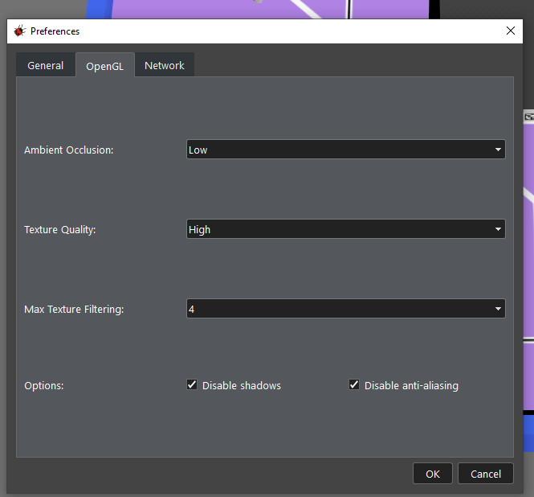
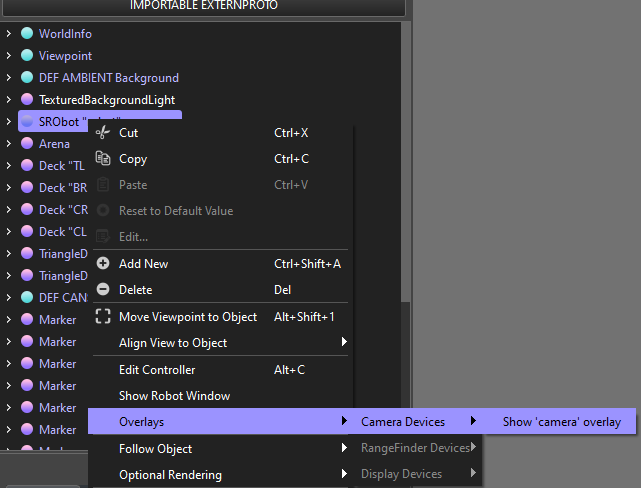

The sbot Simulator
---

The robotics simulator for sbot used by the SRO society, powered by Webots.

In order to use the simulator a few set-up steps need to be done.

- setup
    - prerequisites
        - python 3.9+ (https://www.python.org/downloads/) 
            - homebrew is fine on MacOS
            - apt is fine on Ubuntu
            - windows store is fine on Windows?
        - Webots R2023b (https://cyberbotics.com/#download) 
    - config script
        - right click, open with python
- where the code goes
    - zone_0 folder
    - must be called robot.py
    - other zones are available
    - use the sbot library
- how to run the simulator
    - startup script
    - UI elements
        - 3d world
        - logs in console
        - play/pause buttons
- where the logs are
    - location
    - naming
- improving performance  
    - disable shadows
    - disable anti-aliasing
- common issues
    - remember to sleep
    - reopening the camera overlay 
